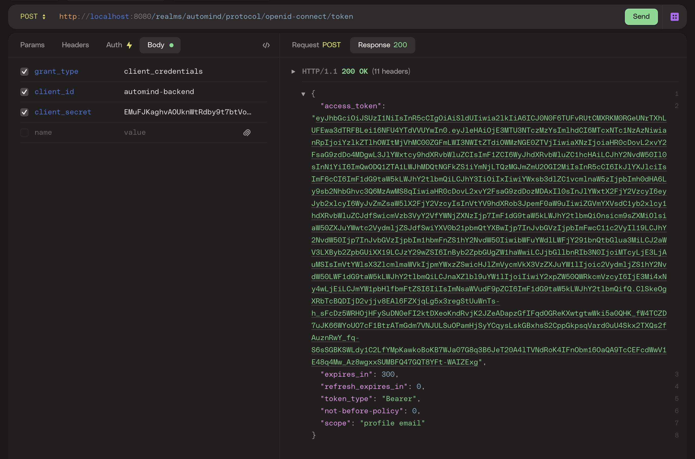

AutoMind Backend
--

## Launch Mongodb database
Launch Mongodb database with docker
```commandline
cd database
./mongodb.sh
```

## Launch backend service
```commandline
./run.sh
```

## Update test cases results
Backend service provide `/results` endpoint to update test cases results, which is designed for automation tests updating the test cases results in a3mind.

### Generate client secret in keycloak
Follow the instruction in `packages/keycloak/README.MD` to generate client secret.


### Switch access token with client secret
Send a POST request to the keycloak access token endpoint `http://<KEYCLOAK-SERVICE>/realms/automind/protocol/openid-connect/token`, with headers:
- grant_type: client_credentials
- client_id: automind-backend
- client_secret: <The client secret>



in the response it will return an `access_token`, use this access_token to update test cases results


