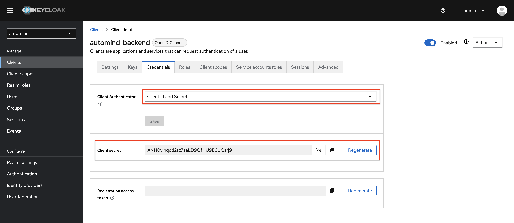

Launch and Set up Keycloak
--

a3mind using Keycloak to do the authN & authZ and account management, there are mainly three steps to set up a working keycloak service:
1. Launch keycloak service with docker,
2. Create realm by importing realm configuration file,
3. Create minimal user account

# Launch keycloak service
```commandline
./run-keycloak.sh
```

> the launching process may need some seconds, be patient

This launch keycloak service at `http://localhost:8080` with admin username=`admin` and password=`admin`, access http://localhost:8080 you can get below initial page


Click `Administration console` redirect to login page, log in with the admin credentials to get into the admin page


Here, the keycloak service is ready for function.

# Create realm
in the admin page, click the `Create Realm` button to create realm,


then create realm by importing the configuration file `automid-realm.json`,


lastly, you can find a new realm named `automind` is created,


click the `Clients` button, there should be clients `automind-app` and `automind-backend` which are our frontend client and backend client.


# Create user account
Now we need to create user which can log in to our a3mind web application. Click `Users` button and then click `Add user` button,


then fill the necessary information to create a user, e.g.
- Username: ariman
- Email: biaofu@thgouthworks.com
- Email verified: Yes
- First Name: Miku
- Last Name: Ariman


then click the `Credentials` tab to add credential for this user,


you can only input simple initial password and enable the `Temporary` option, this will require user to update its password on its first login,
,

continue to save the password, then you will get the new user ready for logging in to `a3mind` web application,


## Configure access control for user
A user created till now only has a username and its password, which can log in the web application, but still not able to access any resource from backend service, access rights should be granted to user for that.

### Config access right for Web resource
Click the `Role mapping` tab,


then click `Assign role` button to open the assign role modal,


in the modal, select `Filter by clients`, and then select `automind-app app-user` and click `Assign` button,


after that, the role should be added to the user, and the user should be able to access resource from the web application.


### Config access right for API resource
a3mind backend supports updating test case result with API calls, that API call needs access token to be provided in the request header, otherwise the access will be rejected.

In the admin page, select `Clients` in the left hand menu, then click `automind-backend` in the client list, in the client details page, click `Credentials` tab, then select `Client Id and Secret` for Client Authenticator, and generate the Client secret,


Now we have the client secret, this secret can be used to switch access token when call API to backend service direct to update the test cases results.
